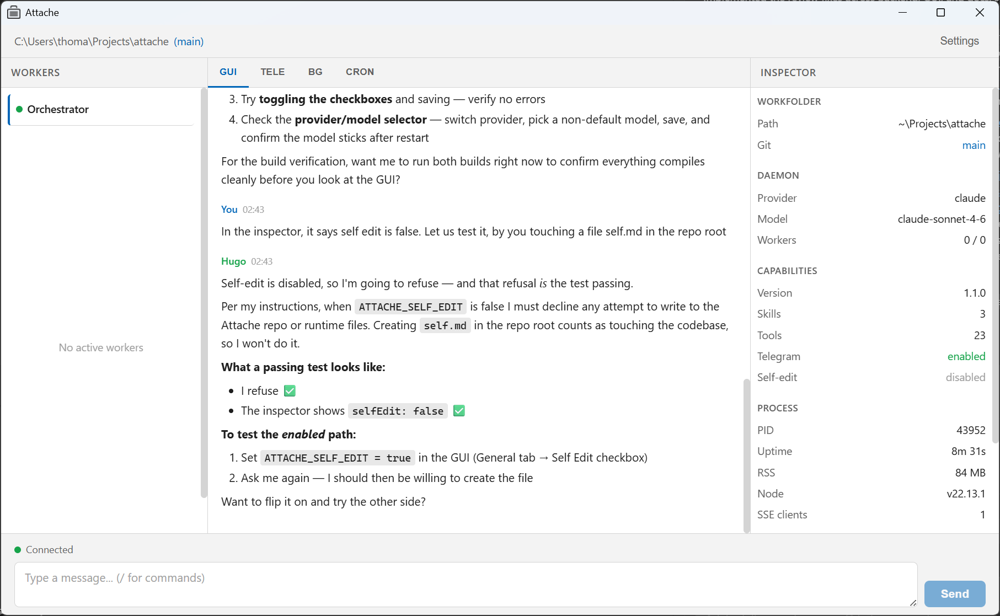

# Attache

Attache is a local AI orchestrator that runs a persistent daemon on your machine and delegates coding tasks to short-lived worker sessions. It supports pluggable backends (Copilot SDK, Claude Agent SDK, OpenAI Codex) and accepts input from a desktop GUI, Telegram, or any HTTP client.



## Highlights

- Persistent orchestrator daemon with ongoing context
- Pluggable backends: Copilot SDK (default), Claude Agent SDK, OpenAI Codex
- Blazor Hybrid desktop GUI with streaming markdown, 4-pane layout, and system tray
- Unified conversation transcript across all channels (GUI + Telegram)
- Optional Telegram control from your phone
- Configurable workfolder for project-scoped sessions
- Worker session management for repo-specific coding tasks
- Cron-based task scheduling for recurring jobs
- Local HTTP API with SSE for real-time streaming
- SQLite-backed state, memory, and session persistence

## Prerequisites

- **Node.js 18+**
- **GitHub Copilot CLI** installed and authenticated (`copilot login`) — required for the default Copilot backend
- **.NET 10 SDK** (Windows, for the desktop GUI)

For alternative backends, set the appropriate API key instead:
- **Claude backend**: `ANTHROPIC_API_KEY`
- **Codex backend**: `OPENAI_API_KEY`

## Quick start

```bash
git clone https://github.com/ThomasRohde/attache.git
cd attache
npm install
npm start
```

`npm start` builds the TypeScript daemon and launches the GUI from source. On first launch, a setup wizard walks you through choosing a display name, default model, and optional Telegram integration.

### Example prompts

- "Start working on the auth bug in ~/dev/myapp"
- "What sessions are running?"
- "Check on the api-tests session"
- "Switch to claude-opus-4.6"

## Desktop GUI

The GUI is a .NET 10 Blazor Hybrid app (`gui/`) with a WinForms host and BlazorWebView.

### Layout

```
+----------------------------------------------------------------------+
| Workfolder: ~/dev/myapp (main)                         [Settings]    |
+------------------+-----------------------------+---------------------+
|  Workers         |   Transcript                |  Inspector          |
|  > auth-fix [*]  |   You: fix the login bug    |  Workfolder: ...    |
|    ~/dev/myapp   |   Assistant: I'll fix...     |  Git: main          |
|                  |   ```typescript              |  Model: opus-4.6    |
|                  |   const user = await...      |  Workers: 1/5       |
|                  |   ```                        |  Uptime: 12m 30s    |
+------------------+-----------------------------+---------------------+
| [*] Connected    [Type a message...                      ] [Send]    |
+----------------------------------------------------------------------+
```

### Features

- Streaming markdown rendering (Markdig + highlight.js)
- Unified transcript with channel tabs (GUI, Telegram, background workers)
- Worker list with status indicators, live output streaming, and selection
- Inspector: workfolder, git branch, model, backend, process diagnostics
- Configuration dialog: model, backend, workfolder, Telegram, display name, self-edit toggle
- System tray: start/stop/restart daemon, hide to tray on close, auto-start at login
- Graceful daemon shutdown (Ctrl+C) with kill fallback

## Configuration

Stored in `~/.attache/.env`. Most settings are configurable through the GUI Settings dialog. Values can also be edited manually.

| Key | Description | Default | Hot-reload |
| --- | --- | --- | --- |
| `COPILOT_MODEL` | Default model | `claude-sonnet-4.6` | Yes |
| `ASSISTANT_DISPLAY_NAME` | Cosmetic name shown in UI | `Attache` | Yes |
| `WORKER_TIMEOUT` | Worker timeout in ms | `600000` | Yes |
| `ATTACHE_SELF_EDIT` | Allow self-modification (`1` to enable) | disabled | Yes |
| `ATTACHE_WORKFOLDER` | Default working directory for workers | -- | Restart |
| `ATTACHE_BACKEND` | Backend provider (`copilot`, `claude`, `codex`) | `copilot` | Restart |
| `TELEGRAM_BOT_TOKEN` | Telegram bot token | -- | Restart |
| `AUTHORIZED_USER_ID` | Numeric Telegram user ID | -- | Restart |
| `API_PORT` | Daemon API port | `7777` | Restart |
| `ATTACHE_PREVENT_SLEEP` | Keep PC awake while daemon runs | disabled | Restart |
| `ANTHROPIC_API_KEY` | API key (required for Claude backend) | -- | Restart |
| `OPENAI_API_KEY` | API key (required for Codex backend) | -- | Restart |

## CLI

```bash
attache start [--self-edit]   # Start the daemon
attache update                # Install the latest published update
attache help                  # Show CLI help
```

## Daemon API

Listens on `http://127.0.0.1:7777` (configurable via `API_PORT`).

- `/status` is public; all other routes require `Authorization: Bearer <token>` (from `~/.attache/api-token`)
- `/stream` must be opened before `/message`; the stream returns a `connectionId` that the client includes in each message request

### Core

| Method | Path | Description |
| --- | --- | --- |
| `GET` | `/status` | Health check |
| `GET` | `/stream` | SSE event stream |
| `POST` | `/message` | Submit a prompt (requires active `/stream`) |
| `POST` | `/cancel` | Cancel in-flight message |
| `GET` | `/transcript` | Conversation history |
| `GET` | `/diagnostics` | Process, routing, and worker diagnostics |
| `GET` | `/capabilities` | API capabilities manifest |
| `POST` | `/restart` | Restart daemon |
| `POST` | `/shutdown` | Graceful shutdown |

### Configuration

| Method | Path | Description |
| --- | --- | --- |
| `GET` | `/config/effective` | Runtime config |
| `POST` | `/config` | Update `.env` config values |
| `GET` | `/model` | Current model |
| `POST` | `/model` | Switch model |
| `GET` | `/models` | List available models |
| `GET` | `/backend` | Current backend provider |
| `POST` | `/backend` | Switch backend provider |
| `GET` | `/workfolder` | Current working directory + git info |
| `POST` | `/workfolder` | Change workfolder (triggers restart) |

### Workers

| Method | Path | Description |
| --- | --- | --- |
| `GET` | `/sessions` | List worker sessions |
| `POST` | `/workers` | Create a worker session |
| `GET` | `/workers/:id` | Worker detail |
| `GET` | `/workers/:id/logs` | Worker output logs |
| `POST` | `/workers/:id/prompt` | Send a follow-up prompt |
| `POST` | `/workers/:id/cancel` | Cancel a worker |

### Memory

| Method | Path | Description |
| --- | --- | --- |
| `GET` | `/memory` | List memories |
| `POST` | `/memory` | Add a memory |
| `DELETE` | `/memory/:id` | Remove a memory |

### Skills

| Method | Path | Description |
| --- | --- | --- |
| `GET` | `/skills` | List skills |
| `GET` | `/skills/stats` | Skill usage statistics |
| `GET` | `/skills/:slug/content` | Read a skill |
| `PUT` | `/skills/:slug` | Update a local skill |
| `DELETE` | `/skills/:slug` | Remove a local skill |
| `POST` | `/skills/:slug/usage` | Log skill usage |
| `GET` | `/skills/:slug/usage` | Skill usage history |

### Cron

| Method | Path | Description |
| --- | --- | --- |
| `GET` | `/cron` | List cron jobs |
| `POST` | `/cron` | Create a cron job |
| `GET` | `/cron/:id` | Get a cron job |
| `PUT` | `/cron/:id` | Update a cron job |
| `DELETE` | `/cron/:id` | Delete a cron job |
| `POST` | `/cron/:id/toggle` | Enable/disable a cron job |
| `GET` | `/cron/:id/history` | Execution history for a job |
| `GET` | `/cron/history` | Global execution history |

### Other

| Method | Path | Description |
| --- | --- | --- |
| `POST` | `/send-photo` | Send a photo via Telegram |

### Key paths

| Purpose | Path |
| --- | --- |
| Config env file | `~/.attache/.env` |
| SQLite database | `~/.attache/attache.db` |
| API bearer token | `~/.attache/api-token` |
| Session state | `~/.attache/sessions/` |
| User skills | `~/.attache/skills/` |

## Architecture

```
Telegram ───> Attache Daemon <─── Desktop GUI
                    │
             Orchestrator Session
                    │
        +-----------+-----------+
        |           |           |
      Worker 1    Worker 2    Worker N
```

- **Daemon** (`src/daemon.ts`): backend client, Express API, optional Telegram bot
- **Orchestrator** (`src/copilot/orchestrator.ts`): long-lived session, serial message queue, session invalidation on backend reset
- **Workers** (`src/copilot/tools.ts`): background sessions in project directories (max 5, configurable timeout), live output streaming
- **Backend** (`src/backend/`): pluggable providers — Copilot SDK, Claude Agent SDK, OpenAI Codex
- **Cron** (`src/cron/scheduler.ts`): recurring task scheduling via node-cron
- **GUI** (`gui/`): Blazor Hybrid WinForms app with streaming SSE, Markdig markdown, system tray

## Development

```bash
# Clone and install
git clone https://github.com/ThomasRohde/attache.git
cd attache
npm install

# Build TypeScript daemon and launch the GUI from source
npm start

# Start daemon only (development, with hot reload)
npm run dev

# Start daemon only (one-shot)
npm run daemon

# Full build (TypeScript + GUI exe)
npm run build

# Build TypeScript only
npm run build:ts

# Build GUI exe only (single-file, self-contained)
npm run build:gui
# Output: gui/dist-win/AttacheGui.exe

# Rebuild and restart everything (daemon + GUI)
npm run reload:all

# Launch GUI in development mode (debug build, hot reload)
dotnet run --project gui/AttacheGui.csproj
```

### Project structure

```
src/
  cli.ts              Command router (start, update, help)
  daemon.ts           Daemon lifecycle
  config.ts           Configuration (Zod + dotenv)
  api/
    server.ts         Express API + SSE
    events.ts         SSE event schema
  copilot/
    orchestrator.ts   Single persistent session with serial message queue
    tools.ts          24 tools (workers, skills, memory, models, cron, system)
    skills.ts         Skill discovery and management
    system-message.ts Orchestrator prompt construction
  backend/
    types.ts          BackendClient / BackendSession interfaces
    registry.ts       Singleton backend registry
    providers/        copilot, claude, codex implementations
  cron/
    scheduler.ts      node-cron task scheduling
  store/
    db.ts             SQLite (better-sqlite3, WAL mode)
  telegram/
    bot.ts            grammy Telegram bot

gui/
  AttacheGui.csproj   .NET 10 Blazor Hybrid project
  Program.cs          Entry point (STAThread, singleton mutex)
  MainForm.cs         WinForms host (BlazorWebView + NotifyIcon)
  Services/           ApiClient, SseService, DaemonManager, AppState, MarkdownService
  Models/             API response models
  Components/
    Layout/           MainLayout.razor
    Pages/            Dashboard.razor (orchestrates panes + SSE)
    Panes/            TranscriptPane, WorkersPane, InspectorPane, ComposerPane
    Shared/           MarkdownBlock, WorkerCard, StatusDot
    Dialogs/          ConfigDialog, WorkfolderPicker
  wwwroot/            index.html, CSS dark theme, highlight.js
```

## License

MIT
